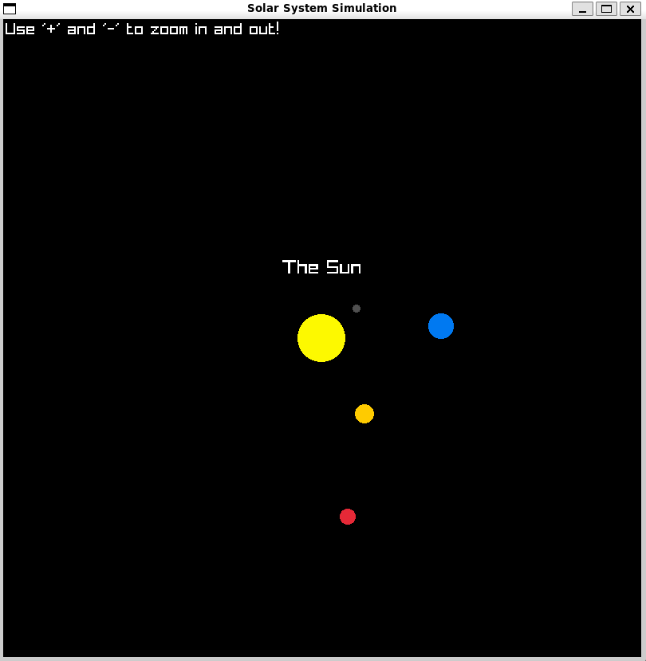

# Solar System Simulation

This project simulates the solar system, displaying the Sun and planets orbiting around it. It uses Newton's law of gravitation to calculate forces and update the positions and velocities of celestial bodies. The simulation is rendered using the Raylib (C) library.

<p align="center">
  
</p>

## Features
- Simulates the orbits of the Sun, Mercury, Venus, Earth, Mars, Jupiter, Saturn, Uranus, and Neptune.
- Zoom in and out functionality to adjust the scale of the simulation.

## Physics
- Gravitational force between bodies is calculated using Newton's law of gravitation:
  $$
  F = \frac{G \cdot m_1 \cdot m_2}{r^2}
  $$
- Velocities and positions of the bodies are updated based on the gravitational forces.

## How to Run
1. **Shell Script**: Run the `build-and-run.sh` script to compile and run the program.
```bash
chmod +x ./build-and-run.sh
```
